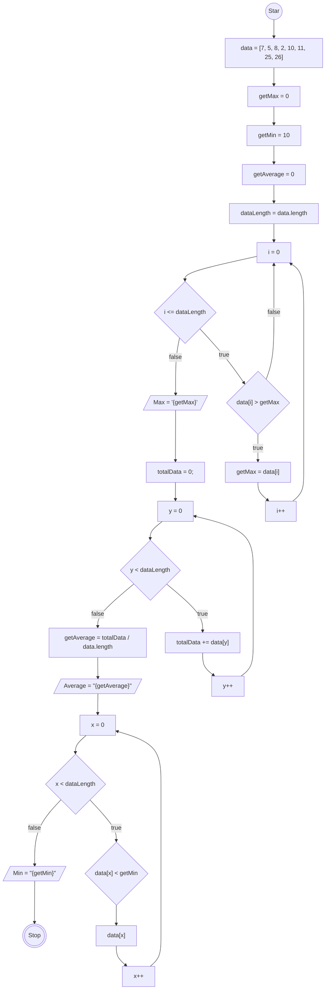

# JavaScript 2

## Menghitung Nilai

Program ini berfungsi untuk menentukan nilai MAX, MIN AVERAGE

## MAX

```mermaid
flowchart TD

A@{ shape: circle, label: Star }
B@{ shape: rect, label: "data = [7, 5, 8, 2, 10, 11, 25, 26]" }
C@{ shape: rect, label: "getMax = 0" }
D@{ shape: rect, label: "getMin = 10" }
E@{ shape: rect, label: "getAverage = 0" }
F@{ shape: rect, label: "dataLength = data.length" }
G@{ shape: rect, label: "i = 0" }
H@{ shape: diamond, label: "i <= dataLength" }
I@{ shape: diamond, label: "data[i] > getMax" }
J@{ shape: rect, label: "getMax = data[i]" }
K@{ shape: lean-r, label: "Max = '{getMax}'" }
L@{ shape: rect, label: "totalData = 0;" }
M@{ shape: rect, label: "y = 0" }
N@{ shape: diamond, label: "y < dataLength" }
O@{ shape: rect, label: "totalData += data[y]" }
P@{ shape: rect, label: y++ }
Q@{ shape: rect, label: "getAverage = totalData / data.length" }
R@{ shape: lean-r, label: 'Average = "{getAverage}"' }
S@{ shape: rect, label: i++ }
T@{ shape: rect, label: "x = 0" }
U@{ shape: diamond, label: "x < dataLength" }
V@{ shape: lean-r, label: 'Min = "{getMin}"' }
W@{ shape: diamond, label: "data[x] < getMin" }
X@{ shape: rect, label: "data[x]" }
Y@{ shape: rect, label: x++ }
Z@{ shape: dbl-circ, label: Stop }


A --> B --> C --> D --> E --> F --> G --> H
H --false--> K
H --true--> I
I --false--> G
I --true--> J --> S --> G

K --> L --> M
M --> N
N --false--> Q --> R --> T
N --true--> O --> P --> M

T --> U
U --false--> V --> Z
U --true--> W --> X --> Y --> T


```
